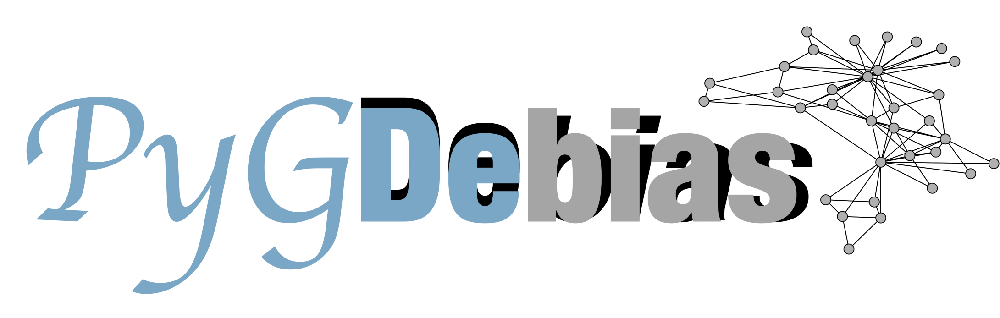

<div  align="center">    

</div>


- [*PyGDebias*: Attributed Network Datasets and Fairness-Aware Graph Mining Algorithms](#pygdebias-attributed-network-datasets-and-fairness-aware-graph-mining-algorithms)
  - [1. Citation](#1-citation)
  - [2. API Cheatsheet](#2-api-cheatsheet)
  - [3. Installations](#3-installations)
    - [3.1 Manually](#31-manually)
    - [3.2 `pip`](#32-pip)
  - [4. Usage \& Examples](#4-usage--examples)
  - [5. Collected Datasets](#5-collected-datasets)
  - [6. Collected Algorithms](#6-collected-algorithms)
  - [7. Performance Leaderboards](#7-performance-leaderboards)
      - [7.1  Group Fairness](#71--group-fairness)
        - [7.1.1 GNN-based ones:](#711-gnn-based-ones)
        - [7.1.2 Non-GNN-based ones:](#712-non-gnn-based-ones)
      - [7.2 Counterfactual Fairness](#72-counterfactual-fairness)
      - [7.3 Individual Fairness](#73-individual-fairness)
      - [7.4 Degree-Related Fairness](#74-degree-related-fairness)
  - [Folder Structure](#folder-structure)
  - [How to Contribute](#how-to-contribute)
  - [Authors \& Acknowledgements](#authors--acknowledgements)
  - [10. Contact](#10-contact)
  - [11. References](#11-references)


-------------------

# *PyGDebias*: Attributed Network Datasets and Fairness-Aware Graph Mining Algorithms


Graph mining algorithms have been playing a critical role in a plethora of areas. However, most of the existing ones lack fairness consideration. Consequently, they may deliver biased predictions toward certain demographic subgroups or individuals. To better understand existing debiasing techniques and facilitate the deployment of fairness-aware graph mining algorithms, we developed this library *PyGDebias* featured for built-in datasets and implementations of popular fairness-aware graph mining algorithms for the study of algorithmic fairness on graphs.


Specifically, this open-source library *PyGDebias* aims to provide a systematic schema to load datasets and compare different debiasing techniques for graph learning algorithms. Specifically, 26 graph datasets (including 24 commonly used ones and two newly constructed ones, AMiner-L and AMiner-S) are collected, and 13 algorithms are implemented in this library.

## 1. Citation

Our survey paper "Fairness in Graph Mining: A Survey" has been released on arxiv [\[PDF\]](http://yushundong.github.io/files/fairness_survey.pdf). If you find *PyGDebias* helpful, we would appreciate citations to the following paper:

```
@article{dong2022fairness,
  title={Fairness in Graph Mining: A Survey},
  author={Dong, Yushun and Ma, Jing and Chen, Chen and Li, Jundong},
  journal={arXiv preprint arXiv:2204.09888},
  year={2022}
}
```

or:

```
Dong, Y., Ma, J., Chen, C., & Li, J. (2022). Fairness in Graph Mining: A Survey. arXiv preprint arXiv:2204.09888.
```

## 2. API Cheatsheet

We summarize the basic API of the implemented graph mining algorithms as below.

* fit(): Execute the training process for the initiated graph mining algorithm.

* predict(): Evaluate the trained graph mining algorithm on the test set.


## 3. Installations

Here, we provide guidelines for setting up the library. There are basically 2 ways to install it


### 3.1 Manually

```bash
# Set up the environment
conda create -n PyGDebias python=3.9
conda activate PyGDebias

# Installation
git clone https://github.com/yushundong/PyGDebias.git
pip install torch==1.12.0+cu116 -f https://download.pytorch.org/whl/torch_stable.html
pip install PyGDebias/ -f https://data.pyg.org/whl/torch-1.12.0%2Bcu116.html -f https://download.pytorch.org/whl/torch_stable.html
```

### 3.2 `pip`

```bash
pip install torch==1.12.0+cu116 -f https://download.pytorch.org/whl/torch_stable.html
pip install pygdebias -f https://data.pyg.org/whl/torch-1.12.0%2Bcu116.html -f https://download.pytorch.org/whl/torch_stable.html
```

## 4. Usage & Examples


~~~python
from dataloading import load_data
from PyGDebias.GUIDE import GUIDE

# Load a dataset. 
# Available choices: 'credit', 'german', 'recidivism', 'facebook', 'pokec_z', 'pokec_n', 'nba', 'twitter', 'google+', 'LCC', 'LCC_small', 'cora', 'citeseer', 'pubmed', 'amazon', 'yelp', 'epinion', 'ciao', 'dblp', 'filmtrust', 'lastfm', 'ml-100k', 'ml-1m', 'ml-20m', 'oklahoma', 'unc28'.
adj, features, labels, idx_train, idx_val, idx_test, sens, sens_idx = load_data('credit')

# Initiate the model (with default parameters).
model = GUIDE()

# Train the model.
model.fit(adj, features, idx_train, idx_val, idx_test, labels, sens)

# Evaluate the model.
model.predict()
~~~


## 5. Collected Datasets

26 graph datasets are collected in this library, including 24 commonly used ones and two newly constructed ones (Aminer-L and Aminer-S).
We provide their descriptions as follows.

-  **Facebook**: Facebook has anonymized features for each node representative of various attributes of a person’s Facebook profile.
-  **Pokec_z & Pokec_n**:  The two datasets are sampled from Pokec by province. Pokec contains anonymized data of the whole social network in 2012, in which the profiles contain gender, age, hobbies, interest, education, working field and etc.
-    **NBA**: This dataset is an extension of a Kaggle dataset containing around 400 NBA basketball players. Features include the performance statistics of players in the 2016-2017 season and other various information e.g., nationality, age, and salary.
-   **German**: The dataset is a credit graph which has 1,000 nodes representing clients in a German bank that are connected based on the similarity of their credit accounts.
-   **Credit**: Credit contains individuals which are connected based on the similarity of their spending and payment patterns.
- **Recidivism**: Recidivism has 18,876 nodes representing defendants who got released on bail at the U.S state courts during 1990-2009, where defendants are connected based on the similarity of past criminal records and demographics.
-  **Google+**: The dataset is created by data collected from a social networking platform developed by Google.
-  **AMiner-L** & **AMiner-S**: **AMiner-L** and **AMiner-S** are co-author networks with sensitive attributes ready for algorithmic fairness study on graphs. Specifically, we construct AMiner-L (titled 'LCC' in our built-in data loader) and AMiner-S (titled 'LCC_small' in our built-in data loader) based on the AMiner network [1]. To construct the two datasets, we first filter out the nodes in the AMiner network with incomplete information. Then we adopt two different approaches to sample a connected network from the filtered dataset: AMiner-L is a subgraph sampled with random walk, while AMiner-S is the largest connected component of the filtered AMiner network. In both datasets, nodes represent the researchers in different fields, and edges denote the co-authorship between researchers. The sensitive attribute is the continent of the affiliation each researcher belongs to, and the labels of nodes represent the primary research field of each researcher. 
-    **Cora**: The Cora dataset is a collection of computer science research papers categorized into different topics.
-  **Citeseer**: The CiteSeer dataset is a digital library of scientific articles, primarily focused on computer science, featuring citation relationships and widely utilized for research in information retrieval and citation network analysis.
-   **Pubmed**: Pubmed contains citation networks that consider articles as nodes and descriptions of articles as their nodal attributes.
-   **Amazon**: The dataset constitutes a respective knowledge graph with entities and relations crawled from Amazon. The collection consists of four different domains: CDs and Vinyl, Clothing, Cell Phones, and Beauty.
-    **Yelp**: The Yelp dataset is a large collection of user-generated reviews and associated ratings for businesses, encompassing various industries and geographical locations.
-    **Ciao**: The Ciao dataset is a comprehensive collection of product reviews and ratings from the Ciao shopping website.
-    **DBLP**: The DBLP dataset is a bibliographic database containing computer science research publications, authors, and their relationships.
- **Filmtrust**: The Filmtrust dataset is a collection of movie ratings and trust relationships between users.
-   **Lastfm**: The Last.fm dataset is a music dataset that contains user listening histories, artist information, and user preferences.
-   **ML100k**: The ML-100K dataset is a widely used benchmark dataset in the field of recommender systems, containing movie ratings and user information for evaluating collaborative filtering algorithms.
-    **ML1m**: The ML-1M dataset is a movie rating dataset that contains one million ratings from users on various movies.
-   **ML20m**: The ML-20M dataset is a larger movie rating dataset consisting of 20 million ratings from users on a vast collection of movies.
- **Oklahoma**: Oklahoma is a dataset composed of social networks of the University of Oklahoma. A link represents a friendship relation in
social media, and every user has a profile for vertex features, including student/faculty status, gender, and major,
-   **UNC**: UNC is a dataset of social networks in the University of North Carolina at Chapel Hill.


We provide their statistics as follows.

|                |               #Nodes               |   #Edges   | #Features |
| :------------: | :--------------------------------: | :--------: | :-------: |
|  **Facebook**  |               1,045                |   53,498   |    573    |
|  **Pokec_z**   |               67,796               |  882,765   |    276    |
|  **Pokec_n**   |               66,569               |  729,129   |    265    |
|    **NBA**     |                403                 |   16,570   |    95     |
|   **German**   |               1,000                |   24,970   |    27     |
|   **Credit**   |               30,000               |  200,526   |    13     |
| **Recidivism** |               18,876               |  403,977   |    18     |
|  **Google**+   |              290,468               |   3,601    |   2,532   |
|  **AMiner-L**  |              129,726               |  591,039   |   5,694   |
|  **AMiner-S**  |               39,424               |   52,460   |   5,694   |
|    **Cora**    |               2,708                |   4,751    |   1,433   |
|  **Citeseer**  |               3,312                |   4,194    |   3,703   |
|   **Pubmed**   |               19,717               |   88,648   |    500    |
|   **Amazon**   |       2,549 (item) 2 (genre)       |   2,549    |    N/A    |
|    **Yelp**    |       2,834 (item) 2 (genre)       |   2,834    |    N/A    |
|    **Ciao**    |  7,375 (user)  106,797 (product)   |   57,544   |    N/A    |
|    **DBLP**    |  22,166 (user)  296,277 (product)  |  355,813   |    N/A    |
| **Filmtrust**  |     1,508 (user) 2,071 (item)      |   35,497   |    N/A    |
|   **Lastfm**   | 1,892 (customer) 17,632 (producer) |   92,800   |    N/A    |
|   **ML100k**   |      943 (user) 1,682 (item)       |  100,000   |     4     |
|    **ML1m**    |     6,040 (user) 3,952 (item)      | 1,000,209  |     4     |
|   **ML20m**    |    138,493 (user) 27,278 (item)    | 20,000,263 |    N/A    |
|  **Oklahoma**  |               3,111                |   73,230   |    N/A    |
|    **UNC**     |               4,018                |   65,287   |    N/A    |


## 6. Collected Algorithms

13 different methods in total are implemented in this library. We provide an overview of their characteristics as follows.
- **FairGNN**: FairGNN is a GNN model designed to address fairness issues in graph-based tasks by incorporating fairness regularization techniques, ensuring equitable treatment of different groups in the learned representations and predictions.
- **EDITS**: EDITS approximates the inputs’ discrimination via Wasserstein distance and directly minimizes it between sensitive and nonsensitive groups by pruning the graph topology and node features.
- **CrossWalk**:  CrossWalk is a method that enhances fairness in graph algorithms by biasing random walks to cross group boundaries and extends the range of the weighting including multi-hop neighbors.
- **UGE**: UGE learns node embeddings from an underlying bias-free graph, which is not influenced by sensitive node attributes to deal with the unbiased graph embedding problem.
- **FairVGNN**: FairVGNN is an advanced model that intelligently masks feature channels linked to sensitive attributes and dynamically fine-tunes encoder weights to reduce the impact of sensitive information, resulting in a fairer and unbiased machine learning algorithm.
- **FairEdit**: NIFTY goes beyond simply removing biases from the input graph during training. It takes a proactive approach by introducing artificial nodes and edges to address biases comprehensively, resulting in a more balanced and unbiased learning process.
- **NIFTY**: NIFTY is a groundbreaking approach designed to improve counterfactual fairness and stability of node representations. It achieves this through the utilization of a novel triplet-based objective function and layer-wise weight normalization using the Lipschitz constant, ensuring enhanced performance and reliability.
- **GEAR**: GEAR tackles graph unfairness through two key mechanisms: counterfactual graph augmentation and an adversarial learning approach that focuses on learning embeddings that are insensitive to sensitive attributes. These techniques collectively contribute to the effective mitigation of unfairness in graph-based models.
- **InFoRM**: InFoRM utilizes the similarity matrix of nodes to assess the individual fairness of GNNs. By incorporating a variant of the (d1, d2)-Lipschitz property, it addresses the challenge of achieving individual fairness solely based on node features, considering the interconnectedness of nodes in a graph.
- **REDRESS**: REDRESS introduces a plug-and-play framework that leverages individual fairness measures from a ranking perspective. This approach optimizes the training of Graph Neural Networks (GNNs) to simultaneously maximize utility and promote ranking-based individual fairness. By learning to rank, the framework ensures consistent relative ranking orders of node pairs in both input and output spaces.
- **GUIDE**: GUIDE is an innovative GNN framework that leverages the similarity matrix of individuals to learn personalized attention mechanisms. This enables the achievement of individual fairness while minimizing disparities at the group level.
- **RawlsGCN**: RawlsGCN integrates the Rawlsian difference principle into GCN, mitigating degree-related unfairness and improving its overall performance.


|    Methods    |       Debiasing Technique        |       Fairness Notions        |                         Paper & Code                         |
| :-----------: | :------------------------------: | :---------------------------: | :----------------------------------------------------------: |
|  FairGNN [2]  |       Adversarial Learning       |        Group Fairness         | [\[Paper\]](https://arxiv.org/pdf/2009.01454.pdf) [\[Code\]](https://github.com/EnyanDai/FairGNN) |
|   EDITS [3]   |          Edge Rewiring           |        Group Fairness         | [\[Paper\]](https://yushundong.github.io/files/WWW2022_EDITS.pdf) [\[Code\]](https://github.com/yushundong/EDITS) |
| FairWalk [4]  |           Rebalancing            |        Group Fairness         | [\[Paper\]](https://publications.cispa.saarland/2933/1/IJCAI19.pdf) [\[Code\]](https://github.com/EnderGed/Fairwalk) |
| CrossWalk [5] |           Rebalancing            |        Group Fairness         | [\[Paper\]](https://arxiv.org/pdf/2105.02725.pdf) [\[Code\]](https://github.com/ahmadkhajehnejad/CrossWalk) |
|    UGE [6]    |          Edge Rewiring           |        Group Fairness         | [\[Paper\]](https://github.com/MyTHWN/UGE-Unbiased-Graph-Embedding) [\[Code\]](https://github.com/MyTHWN/UGE-Unbiased-Graph-Embedding) |
| FairVGNN [7]  |       Adversarial Learning       |        Group Fairness         | [\[Paper\]](https://arxiv.org/pdf/2206.03426.pdf) [\[Code\]](https://github.com/yuwvandy/fairvgnn) |
| FairEdit [8]  |          Edge Rewiring           |        Group Fairness         | [\[Paper\]](https://arxiv.org/pdf/2201.03681.pdf) [\[Code\]](https://github.com/royull/FairEdit) |
|   NIFTY [9]   | Optimization with Regularization | Group/Counterfactual Fairness | [\[Paper\]](https://arxiv.org/pdf/2102.13186.pdf) [\[Code\]](https://github.com/chirag126/nifty) |
|   GEAR [10]   |          Edge Rewiring           | Group/Counterfactual Fairness | [\[Paper\]](https://arxiv.org/pdf/2201.03662.pdf) [\[Code\]](https://github.com/jma712/GEAR) |
|  InFoRM [11]  | Optimization with Regularization |      Individual Fairness      | [\[Paper\]](http://jiank2.web.illinois.edu/files/kdd20/kang20inform.pdf) [\[Code\]](https://github.com/jiank2/inform) |
| REDRESS [12]  | Optimization with Regularization |      Individual Fairness      | [\[Paper\]](http://yushundong.github.io/files/kdd2021.pdf) [\[Code\]](https://github.com/yushundong/REDRESS) |
|  GUIDE [13]   | Optimization with Regularization |      Individual Fairness      | [\[Paper\]](http://yushundong.github.io/files/KDD22_group_individual.pdf) [\[Code\]](https://github.com/mikesong724/GUIDE) |
| RawlsGCN [14] |           Rebalancing            |    Degree-Related Fairness    | [\[Paper\]](http://jiank2.web.illinois.edu/files/www22/kang22rawlsgcn.pdf) [\[Code\]](https://github.com/jiank2/RawlsGCN) |


## 7. Performance Leaderboards

We summarize the performances of the implemented 13 graph mining algorithms/frameworks by fairness notions, including group fairness, individual fairness, counterfactual fairness, and degree-related fairness.


#### 7.1  Group Fairness

##### 7.1.1 GNN-based ones:

We present the evaluation results of both utility (including AUCROC, F1 score, and accuracy) and fairness (including $\Delta_{SP}$ and $\Delta_{EO}$) on Credit and Recidivism below.

|             |     Credit      |     Credit      |     Credit      |     Credit      |     Credit      |   Recidivism    |   Recidivism    |   Recidivism    |   Recidivism    |   Recidivism    |
| ----------- | :-------------: | :-------------: | :-------------: | :-------------: | :-------------: | :-------------: | :-------------: | :-------------: | :-------------: | :-------------: |
|             |     AUCROC      |       F1        |       Acc       |  $\Delta_{SP}$  |  $\Delta_{EO}$  |     AUCROC      |       F1        |       Acc       |  $\Delta_{SP}$  |  $\Delta_{EO}$  |
| GCN_Vanilla |   0.722±0.005   |   0.876±0.002   |   0.784±0.004   |   0.160±0.110   |   0.108±0.073   |   0.865±0.020   |   0.672±0.031   |   0.804±0.014   |   0.094±0.012   |   0.130±0.023   |
| FairGNN     | **0.729±0.004** | **0.879±0.002** | **0.790±0.004** |   0.022±0.007   |   0.020±0.005   | **0.929±0.002** | **0.820±0.004** | **0.880±0.002** |   0.073±0.006   |   0.046±0.006   |
| NIFTY       |   0.717±0.000   |   0.876±0.000   |   0.782±0.001   |   0.019±0.019   |   0.014±0.010   |   0.841±0.006   |   0.403±0.008   |   0.716±0.002   | **0.017±0.001** | **0.006±0.003** |
| EDITS       |   0.667±0.012   |   0.876±0.000   |   0.779±0.000   | **0.005±0.002** | **0.004±0.002** |   0.847±0.026   |   0.607±0.058   |   0.773±0.029   |   0.026±0.012   |   0.013±0.001   |
| FairVGNN    |   0.654±0.034   |   0.865±0.018   |   0.772±0.015   |   0.030±0.040   |   0.023±0.032   |   0.826±0.009   |   0.722±0.015   |   0.796±0.020   |   0.090±0.009   |   0.089±0.014   |
| FairEdit    |   0.666±0.067   |   0.809±0.032   |   0.716±0.032   |   0.107±0.046   |   0.098±0.045   |   0.884±0.007   |   0.798±0.009   |   0.852±0.007   |   0.070±0.002   |   0.044±0.002   |


##### 7.1.2 Non-GNN-based ones:

We present the evaluation results of fairness (including classification accuracy on the learned embeddings) on Pokec_z and Pokec_n below.

|           | Classification Acc of Gender on Pokec_z | Classification Acc of Gender on Pokec_n |
| :-------: | :-------------------------------------: | :-------------------------------------: |
| FairWalk  |             0.4962 ± 0.0031             |             0.5016 ± 0.0036             |
| CrossWalk |             0.4943 ± 0.0007             |             0.5047 ± 0.0036             |
|   UGE-C   |          **0.4908 ± 0.00008**           |           **0.5002 ± 0.0001**           |


#### 7.2 Counterfactual Fairness

We present the evaluation results of both utility (including AUCROC, F1 score, and accuracy) and fairness (including $\Delta_{SP}$, $\Delta_{EO}$, $\delta_{CF}$, and $R^2$) on Credit and Recidivism below.

|             | **Credit**        |    **Credit**    |    **Credit**    |    **Credit**    |    **Credit**     |    **Credit**     | **Credit**       |   **Recidivism**    |   **Recidivism**   |  **Recidivism**   |   **Recidivism**   |   **Recidivism**   |     Recidivism     |    Recidivism     |
| ----------- | :---------------- | :--------------: | :--------------: | :--------------: | :---------------: | :---------------: | ---------------- | :-----------------: | :----------------: | :---------------: | :----------------: | :----------------: | :----------------: | :---------------: |
|             | AUCROC            |        F1        |       Acc        |  $\Delta_{SP}$   |   $\Delta_{EO}$   |   $\delta_{CF}$   | $R^2$            |       AUCROC        |         F1         |        Acc        |   $\Delta_{SP}$    |   $\Delta_{EO}$    |   $\delta_{CF}$    |       $R^2$       |
| GCN_Vanilla | 0.684 ± 0.019     |   0.794± 0.027   |   0.698± 0.028   |   0.108± 0.031   |   0.087± 0.035    |   0.042± 0.029    | 0.022± 0.014     |    0.885 ± 0.018    |   0.782 ± 0.023    |   0.838 ± 0.017   |   0.075 ± 0.014    |   0.023 ± 0.019    |   0.132 ± 0.059    |   0.075 ± 0.028   |
| NIFTY-GCN   | 0.685 ± 0.007     |   0.792± 0.007   |   0.697± 0.007   |   0.106± 0.021   |   0.097± 0.024    |   0.004± 0.004    | 0.017± 0.003     |    0.799 ± 0.051    |   0.669 ± 0.050    |   0.752 ± 0.065   | **0.036 ± 0.022** | **0.019 ± 0.015** |   0.031 ± 0.017    | **0.025 ± 0.018** |
| GEAR-GCN    | **0.740 ± 0.008** | **0.835± 0.008** | **0.755± 0.011** | **0.104± 0.013** | **0.086± 0.018** | **0.001± 0.001** | **0.010± 0.003** | **0.896 ± 0.016** | **0.800 ± 0.031** | **0.852 ± 0.026** |   0.058 ± 0.017    |   0.019 ± 0.023    | **0.003 ± 0.002** |   0.038 ± 0.012   |


#### 7.3 Individual Fairness

We present the evaluation results of both utility (including AUCROC) and fairness (including IF, GDIF, and Ranking-based IF) on Credit and Recidivism below.

|         |     Credit      |       Credit       |     Credit      |      Credit      |   Recidivism    |     Recidivism     |   Recidivism    |    Recidivism    |
| :-----: | :-------------: | :----------------: | :-------------: | :--------------: | :-------------: | :----------------: | :-------------: | :--------------: |
|         |     AUCROC      | IF (in $10^3$) |      GDIF       | Ranking-based IF |       AUC       | IF (in $10^3$) |      GDIF       | Ranking-Based IF |
|   GCN   | **0.666±0.023** |  190.408±135.412   |   1.628±0.596   |   0.611±0.003    | **0.962±0.001** |   1.32e6±6.19e5    |   1.12±0.001    |   0.965±0.001    |
| InFoRM  |   0.645±0.010   |    23.560±8.760    |   2.422±0.143   |   0.621±0.014    |   0.651±0.043   |    11.606±4.28     |   1.106±0.133   |   0.971±0.001    |
| REDRESS |   0.570±0.005   |  8.827e11±1.95e11  |   3.048±0.301   | **0.913±0.005**  |   0.687±0.067   | 4.0393e12±6.84e12  |   1.816±0.594   | **0.980±0.002**  |
|  GUIDE  |   0.632±0.008   |  **0.337±0.063**   | **1.003±0.002** |   0.665±0.010    |   0.797±0.024   |  **9.629±0.831**   | **1.006±0.003** |   0.972±0.001    |


#### 7.4 Degree-Related Fairness

We present the evaluation results of both utility (including accuracy) and fairness (including bias according to Rawlsian difference principle) on Amazon-Photo dataset below.

|          |      Accuracy       | Bias (according to Rawlsian difference principle) |
| :------: | :-----------------: | :-----------------------------------------------: |
|   GCN    |   0.8262 ±0.0090    |                   0.5033±0.1552                   |
| RawlsGCN | **0.8708 ± 0.0134** |                 **0.0782±0.0071**                 |

## Folder Structure
.  
├── LICENSE  
├── MANIFEST.in  
├── README.md  
├── docs  
├── pygdebias  
│   ├── __init__.py  
│   ├── datasets    
│   ├── debiasing  
│   └── metrics  
├── requirements.txt  
├── setup.cfg  
└── setup.py  


## How to Contribute
You are welcome to become part of this project. See [contribute guide](./docs/contribute.md) for more information.

## Authors & Acknowledgements
Yushun Dong, Song Wang, Zaiyi Zheng, Zhenyu Lei, Jing Ma, Chen Chen, Jundong Li

We extend our heartfelt appreciation to everyone who has contributed to and will contribute to this work. 

## 10. Contact

Reach out to us by submitting an issue report or sending an email to yd6eb@virginia.edu.

## 11. References


[1] [Tang, J., Zhang, J., Yao, L., Li, J., Zhang, L., & Su, Z. (2008, August). Arnetminer: extraction and mining of academic social networks. In Proceedings of the 14th ACM SIGKDD international conference on Knowledge discovery and data mining (pp. 990-998).](https://dl.acm.org/doi/abs/10.1145/1401890.1402008?casa_token=aXbjaU1epEsAAAAA:Js0xGG7HOZW9F-FhroRG0tZ7EezCwE_U8FTMk4eUR3M7pyqcPf6m2la09lT-jDt5w_6A0ONSkYs)


[2] [Dai, E., & Wang, S. (2021, March). Say no to the discrimination: Learning fair graph neural networks with limited sensitive attribute information. In *Proceedings of the 14th ACM International Conference on Web Search and Data Mining* (pp. 680-688).](https://dl.acm.org/doi/abs/10.1145/3437963.3441752)


[3] [Dong, Y., Liu, N., Jalaian, B., & Li, J. (2022, April). Edits: Modeling and mitigating data bias for graph neural networks. In *Proceedings of the ACM Web Conference 2022* (pp. 1259-1269).](https://dl.acm.org/doi/abs/10.1145/3485447.3512173)


[4] [Rahman, T., Surma, B., Backes, M., & Zhang, Y. (2019). Fairwalk: Towards fair graph embedding. In *Proceedings of the Twenty-Eighth International Joint Conference on Artificial Intelligence 2022* (pp. 3289-3295).](https://publications.cispa.saarland/2933/)


[5] [Khajehnejad, A., Khajehnejad, M., Babaei, M., Gummadi, K. P., Weller, A., & Mirzasoleiman, B. (2022, June). CrossWalk: fairness-enhanced node representation learning. In Proceedings of the AAAI Conference on Artificial Intelligence (Vol. 36, No. 11, pp. 11963-11970).](https://ojs.aaai.org/index.php/AAAI/article/view/21454)


[6] [Wang, N., Lin, L., Li, J., & Wang, H. (2022, April). Unbiased graph embedding with biased graph observations. In *Proceedings of the ACM Web Conference 2022* (pp. 1423-1433).](https://dl.acm.org/doi/abs/10.1145/3485447.3512189)


[7] [Wang, Y., Zhao, Y., Dong, Y., Chen, H., Li, J., & Derr, T. (2022). Improving Fairness in Graph Neural Networks via Mitigating Sensitive Attribute Leakage. In *Proceedings of the 28th ACM SIGKDD Conference on Knowledge Discovery and Data Mining* (pp. 1938–1948).](https://dl.acm.org/doi/10.1145/3534678.3539404)


[8] [Loveland, D., Pan, J., Bhathena, A. F., & Lu, Y. (2022). FairEdit: Preserving Fairness in Graph Neural Networks through Greedy Graph Editing. arXiv preprint arXiv:2201.03681.](https://arxiv.org/abs/2201.03681)


[9] [Agarwal, C., Lakkaraju, H., & Zitnik, M. (2021, December). Towards a unified framework for fair and stable graph representation learning. In Uncertainty in Artificial Intelligence (pp. 2114-2124). PMLR.](https://proceedings.mlr.press/v161/agarwal21b)


[10] [Ma, J., Guo, R., Wan, M., Yang, L., Zhang, A., & Li, J. (2022, February). Learning fair node representations with graph counterfactual fairness. In Proceedings of the Fifteenth ACM International Conference on Web Search and Data Mining (pp. 695-703).](https://dl.acm.org/doi/abs/10.1145/3488560.3498391)


[11] [Kang, J., He, J., Maciejewski, R., & Tong, H. (2020, August). Inform: Individual fairness on graph mining. In Proceedings of the 26th ACM SIGKDD International Conference on Knowledge Discovery & Data Mining (pp. 379-389).](https://dl.acm.org/doi/abs/10.1145/3394486.3403080)


[12] [Dong, Y., Kang, J., Tong, H., & Li, J. (2021, August). Individual fairness for graph neural networks: A ranking based approach. In Proceedings of the 27th ACM SIGKDD Conference on Knowledge Discovery & Data Mining (pp. 300-310).](https://dl.acm.org/doi/abs/10.1145/3447548.3467266)


[13] [Song, W., Dong, Y., Liu, N., & Li, J. (2022, August). GUIDE: Group Equality Informed Individual Fairness in Graph Neural Networks. In Proceedings of the 28th ACM SIGKDD Conference on Knowledge Discovery and Data Mining (pp. 1625-1634).](https://dl.acm.org/doi/abs/10.1145/3534678.3539346)


[14] [Kang, J., Zhu, Y., Xia, Y., Luo, J., & Tong, H. (2022, April). Rawlsgcn: Towards rawlsian difference principle on graph convolutional network. In Proceedings of the ACM Web Conference 2022 (pp. 1214-1225).](https://dl.acm.org/doi/abs/10.1145/3485447.3512169?casa_token=zVE-m1U23lsAAAAA:QajB3yyevB2wpOtMGVK_Bf53pA48r56Vm8iyDQjlV4FlOEnWD3gbNeo3FxE8SXtLC2yC8lzMVmA)
